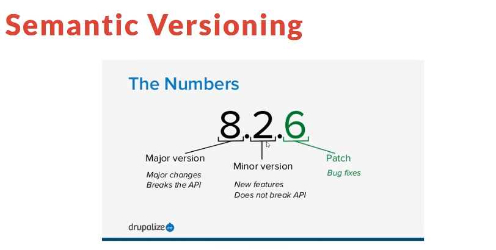

- [What is NPM](#what-is-npm)
- [Basic](#basic)
- [The `package.json` file and `npm init`](#the-packagejson-file-and-npm-init)
  - [`--yes`](#--yes)
  - [default options for `npm init`](#default-options-for-npm-init)
- [Installing modules](#installing-modules)
- [`index.js`](#indexjs)
- [`devDependencies`](#devdependencies)
- [Removing dependencies](#removing-dependencies)
- [Installing earlier version](#installing-earlier-version)
- [Update version](#update-version)
- [Versioning](#versioning)
- [Global Modules & `nodemon`](#global-modules--nodemon)
- [`--depth`](#--depth)
- [Scripts](#scripts)

# What is NPM

NPM stands for Node Package Manager. It is the package manager of JavaScript, a.k.a the `pip` of JavaScript. It comes pre-installed with NodeJS.

If we want to use NPM, we need to have NodeJS installed on our computer.

# Basic

Checking `npm` version:
```sh
$ npm --version
$ npm -v
```

Seeing the help page:
```sh
npm help
npm
```

# The `package.json` file and `npm init`

`package.json` is probably the most important file in the whole NodeJS/ JavaScript world. It is a **manifest file** with all of the application information like name, version, author..etc. However that's not the most important part.

The most important part is that it holds all of the application's dependencies, both names and version.

Don't create this file manually, instead run:
```sh
$ npm init
```
```sh
$ tree 
.
└── package.json

0 directories, 1 file
```
```sh
{
  "name": "npm-app",
  "version": "1.0.0",
  "description": "Learning NPM",
  "main": "index.js",
  "scripts": {
    "test": "echo \"Error: no test specified\" && exit 1"
  },
  "author": "Kenny Nguyen",
  "license": "MIT"
}
```

Let's say we are happy with our application and we want to push it to a Git repository for other people to see. When we do this, we **do not** want to include the `node_modules` directory and have all of these libraries clog up the codebase.

We simply need the `package.json` file. With this file in the current directory, `npm install` would install of the required dependencies.

## `--yes`

We can also run through `npm init` without having to answer all of the questions and just accepts all of the default options.
```sh
$ npm init --yes

Wrote to /home/kkennynguyen/Desktop/npm-crash-course/npm-app/package.json:

{
  "name": "npm-app",
  "version": "1.0.0",
  "description": "",
  "main": "index.js",
  "scripts": {
    "test": "echo \"Error: no test specified\" && exit 1"
  },
  "keywords": [],
  "author": "",
  "license": "ISC"
}

```

## default options for `npm init`

We can also change the default option, such as the author's name and license type.
```sh
$ npm config set init-author-name 'Kenny Nguyen'
$ npm set init-license 'MIT'
```
..
then
```sh
$ npm init --yes            
Wrote to /home/kkennynguyen/Desktop/npm-crash-course/npm-app/package.json:

{
  "name": "npm-app",
  "version": "1.0.0",
  "description": "",
  "main": "index.js",
  "scripts": {
    "test": "echo \"Error: no test specified\" && exit 1"
  },
  "keywords": [],
  "author": "Kenny Nguyen",
  "license": "MIT"
}
```

We can also delete individual configs by:
```sh
$ npm config delete init-author-name
```

# Installing modules

```sh
$ npm install lodash
```

```
.
├── node_modules
│   └── lodash
├── package.json
└── package-lock.json

2 directories, 2 files
```

So what happens is that the `lodash` package has been downloaded into the `node_modules/` directory.

# `index.js`

```sh
touch index.js
```

```
const _ =  require('lodash');

const numbers = [1,2,3,4,5];

_.each(numbers, function(n, i){
  console.log(n);
});
```

Whenever we have installed a module, and we want to use it inside of our application, we need to assign it to a constant using `require()`.

Then, we can run the application:
```sh
$ node index
1
2
3
4
5
```

# `devDependencies`

These are the dependencies that we only need during the development process, and not production environment. Examples of these are sass compilers, JS bundler..etc.

```sh
$ npm install gulp gulp-sass --save-dev 
```

Look at the `package.json` again:
```json
{
  "name": "npm-app",
  "version": "1.0.0",
  "description": "",
  "main": "index.js",
  "scripts": {
    "test": "echo \"Error: no test specified\" && exit 1"
  },
  "keywords": [],
  "author": "Kenny Nguyen",
  "license": "MIT",
  "dependencies": {
    "lodash": "^4.17.21"
  },
  "devDependencies": {
    "gulp": "^4.0.2",
    "gulp-sass": "^5.0.0"
  }
}
```

Development dependencies are not added if we run:
```sh
$ npm install --production
```

We can test this by first:
```sh
rm -rf node_modules
```

then, only one module is added (`lodash`):
```sh
$ npm install --production

added 1 package, and audited 2 packages in 771ms

found 0 vulnerabilities
```

# Removing dependencies

Let's say we don't want to use `gulp-sass`.

```sh
$ npm uninstall gulp-sass
```

There are several aliases for uninstalling: `rm`, `remove`.

# Installing earlier version

Let's say we want to install an earlier version of `lodash`:
```sh
$ npm install lodash@4.17.3
```

# Update version

```sh
$ npm update lodash
```

# Versioning



```json
  "dependencies": {
    "lodash": "^4.17.3"
  }
```

What does the carat symbol does? It indicates that the **latest minor version** will be installed upon `npm install`.

With the above configuration, if `lodash` has released `4.19`, `npm init` will install `4.19`. If `lodash` has released `5.0.0`, i.e a new major version, that will **not** be installed.


```json
  "dependencies": {
    "lodash": "~4.17.3"
  }
```

Using the tilda symbol means keep the minor version, but go to **the latest patch version**.

**Without any symbol**, the exact symbol will be used.

Don't do this:
```js
  "dependencies": {
    "lodash": "*"
  }
```

# Global Modules & `nodemon`

Up to this point, we have only been using local modules, which is within our local directory here.

Sometimes, we want to install things globally.

*(Before this, I needed to fix the permission error on my Linux system due to `EACES` error and no, using `sudo npm...` would be bad.)*

```sh
$ npm install -g nodemon
```

We can also do:
```sh
$ npm root -g
$ npm list -g
```

Global modules can be started from anywhere:
```sh
$ nodemon
[nodemon] 2.0.12
[nodemon] to restart at any time, enter `rs`
[nodemon] watching path(s): *.*
[nodemon] watching extensions: js,mjs,json
[nodemon] starting `node index.js`
1
2
3
4
5
[nodemon] clean exit - waiting for changes before restart

```

`nodemon` is pretty neat, it will watch your all your npm applications for changes. Let's say we update `index.js` to this:
```js
const _ =  require('lodash');

const numbers = [1,2,3,4,5];

_.each(numbers, function(n, i){
  console.log('hello');
  console.log(n);
});
```
.. changes will be picked up straight away, and the application would be reloaded
```
$ nodemon
[nodemon] 2.0.12
[nodemon] to restart at any time, enter `rs`
[nodemon] watching path(s): *.*
[nodemon] watching extensions: js,mjs,json
[nodemon] starting `node index.js`
1
2
3
4
5
[nodemon] clean exit - waiting for changes before restart
[nodemon] restarting due to changes...
[nodemon] starting `node index.js`
hello
1
hello
2
hello
3
hello
4
hello
5
[nodemon] clean exit - waiting for changes before restart
```

Another good module to be installed globally is `live-server`.

Removing package globally is simple:
```sh
$ npm remove -g X
```

# `--depth`

Let's say we install `gulp` and `npm` insstall 348 packages with this. Then we do `npm list`, we'd see a massive list.

We can list only the highest level packages with the `--depth` or `-d` flag.
```sh
$ npm list --depth=0
npm-app@1.0.0 /home/kkennynguyen/Desktop/npm-crash-course/npm-app
├── gulp@4.0.2
└── lodash@4.17.21
```

# Scripts

```json
  "scripts": {
    "test": "echo \"Error: no test specified\" && exit 1"
  },
```

```sh
$ npm test

> npm-app@1.0.0 test
> echo "Error: no test specified" && exit 1

Error: no test specified
```

If we do this:
```json
  "scripts": {
    "start": "node index"
  },
```

```sh
$ npm start

> npm-app@1.0.0 start
> node index

1
2
3
4
5
```

